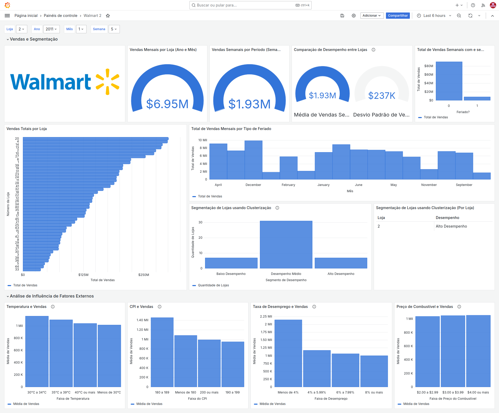

# Walmart Sales Analysis and Forecasting

Este repositório contém uma análise de dados e previsões das vendas da rede Walmart. O projeto está dividido em duas partes: a análise e visualização de dados com SQL (para ser usado no Grafana) e a previsão de vendas com Python.

## 🔍 Visão Geral

O objetivo deste projeto é identificar padrões de vendas, analisar o impacto de fatores externos e prever tendências futuras com base em dados históricos. As análises são realizadas com SQL para criar dashboards interativos no Grafana, e a previsão de séries temporais é feita utilizando técnicas de Machine Learning em Python.

## 📂 Estrutura do Repositório

```
├── SQL_Dashboard
│   ├── queries.sql
│   └── README.md
├── Python_Forecasting
│   ├── forecasting.py
│   ├── clustering.py
│   ├── requirements.txt
│   └── README.md
├── grafana_dashboard.png
└── README.md
```

### 1. **SQL Dashboard (Grafana)**
Esta parte do projeto foca na análise de vendas com SQL, que é visualizada no Grafana. O dashboard inclui:

- **Análise de Tendências de Vendas**: Visualização das vendas ao longo do tempo.
- **Impacto de Feriados nas Vendas**: Comparação das vendas durante feriados e semanas normais.
- **Análise de Influência de Fatores Externos**: Correlação entre vendas e fatores como temperatura, preço de combustível, CPI e desemprego.
- **Identificação de Lojas de Alto e Baixo Desempenho**: Segmentação de lojas com base em desempenho usando SQL.
  
Você pode acessar as consultas SQL na pasta `SQL_Dashboard`. Veja um exemplo do dashboard abaixo:



### 2. **Previsão de Vendas e Clusterização com Python**
A parte de previsão de vendas e análise avançada é feita em Python e inclui:

- **Previsão de Vendas com Prophet**: Modelos de séries temporais para prever vendas futuras.
- **Segmentação de Lojas (Clusterização)**: Análise de similaridade entre lojas usando K-means para identificar grupos de lojas com características similares.

Os scripts Python estão na pasta `Python_Forecasting` e podem ser executados separadamente. Certifique-se de instalar as dependências com:

```bash
pip install -r Python_Forecasting/requirements.txt
```

## 🚀 Como Executar

### 1. Configuração do Dashboard no Grafana

1. Importe as consultas SQL na pasta `SQL_Dashboard/queries.sql` para sua instância do Grafana.
2. Conecte sua fonte de dados e configure o dashboard para visualizar as métricas.

### 2. Execução dos Scripts Python

1. Navegue até a pasta `Python_Forecasting`:
   ```bash
   cd Python_Forecasting
   ```
2. Instale as dependências:
   ```bash
   pip install -r requirements.txt
   ```
3. Execute os scripts conforme necessário:
   ```bash
   python forecasting.py
   python clustering.py
   ```

## 📊 Visualizações

- As análises SQL são visualizadas no Grafana com o dashboard personalizado.
- As previsões e gráficos de clusterização em Python são gerados separadamente e podem ser visualizados no Jupyter Notebook ou salvos como imagens.

## 🛠️ Tecnologias Utilizadas

- **SQL** para consultas e análises de dados.
- **Grafana** para visualização de dados.
- **Python** com bibliotecas como `Prophet`, `pandas`, `matplotlib` e `sklearn` para previsão e clusterização.

## 📝 Licença

Este projeto está sob a licença MIT. Sinta-se à vontade para usá-lo e modificá-lo conforme necessário.
